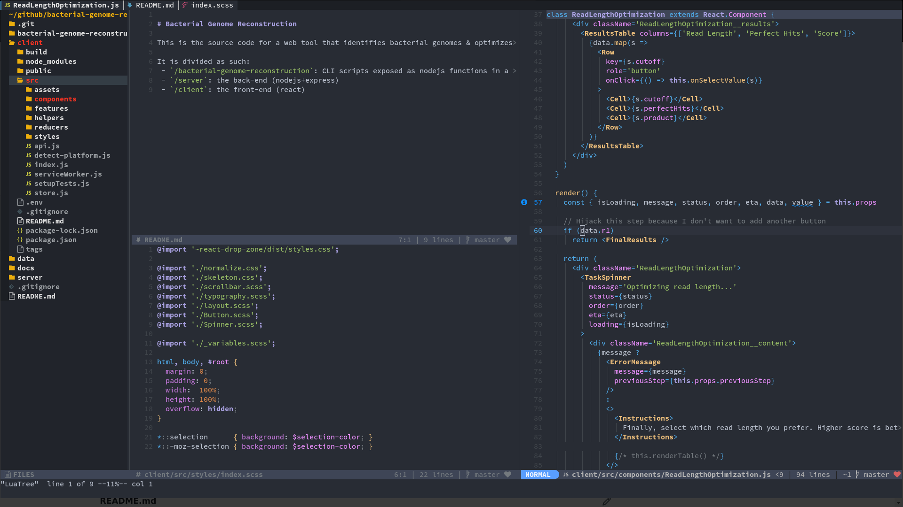

# neovim configuration

This is my personal neovim configuration. Feel free to try it out.

```
git clone https://github.com/romgrk/nvim ~/.config/nvim
nvim --headless +PlugInstall +PlugUpdate
```



### Features

 - Mappings are optimized for editing speed: [keymap.vim](./rc/keymap.vim)
 - Colorschme ported from emacs-doom: [doom-one.vim](https://github.com/romgrk/doom-one.vim)
